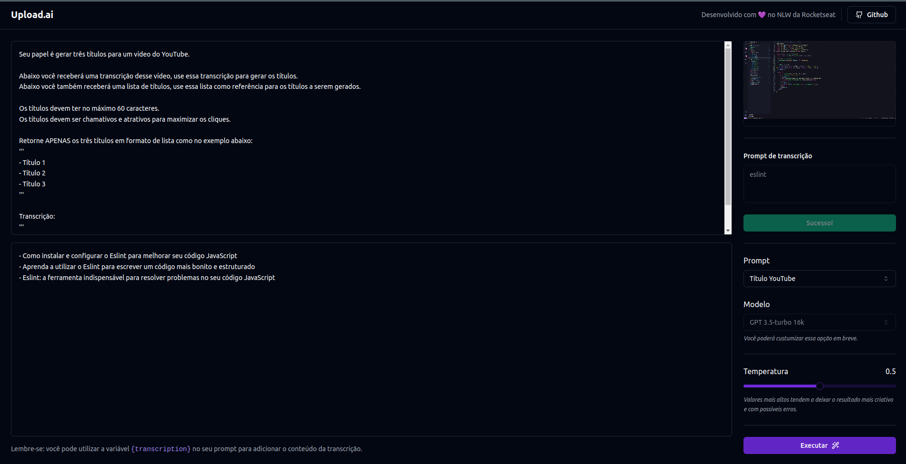
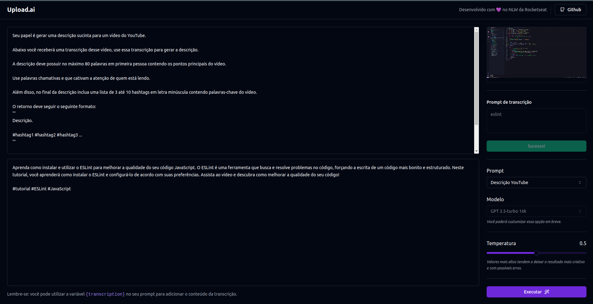
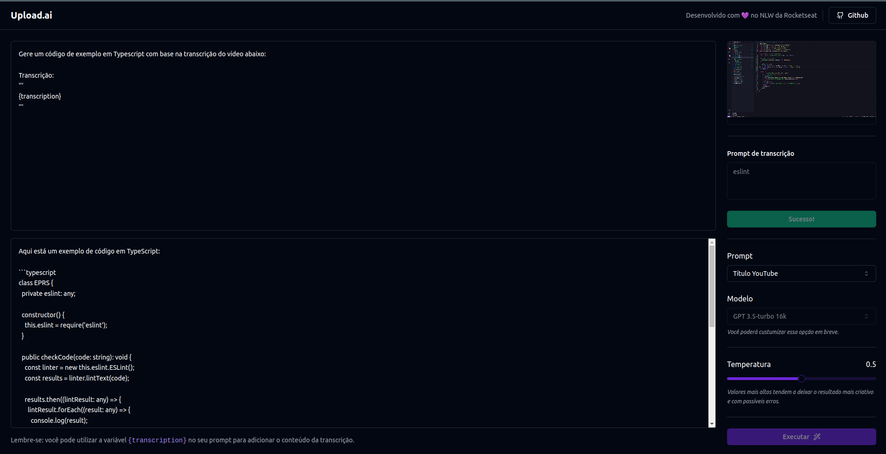

# NLW-upload-ai

Playground de inteligência artificial com possibilidade de carregar vídeo. A aplicação usa a API da OpenAI para gera títulos e descrições com base na transcrição do vídeo carregado, facilitando a parte da criatividade na hora em que não sabemos o que colocar no título ou descrição do vídeo, por exemplo para o Youtube.

### Gerando titulos:
<h1>
    
</h1>

### Gerando descrições:

<h1>
    
</h1>

## Aplicação conta com 2 opções principais para ajudar a IA:

**Prompt de transcrição** - São palavras chaves para ajudar a IA detectar palavras citadas no vídeo.

**Temperatura** - É o nível da criatividade que a IA ira usar para criar títulos e descrições.

# Além das funções base, o prompt é editavel:

<h1>
    
</h1>

